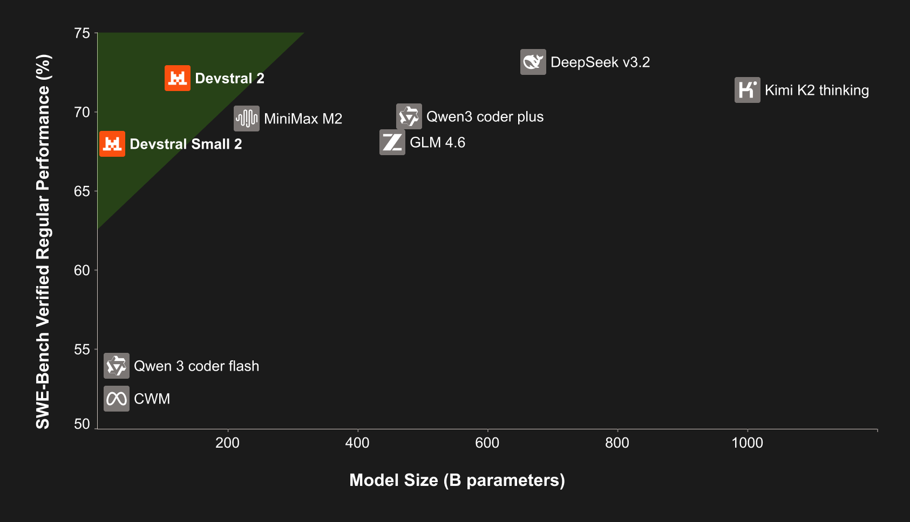
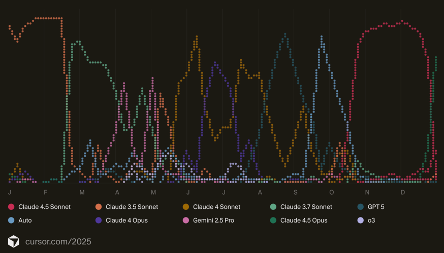
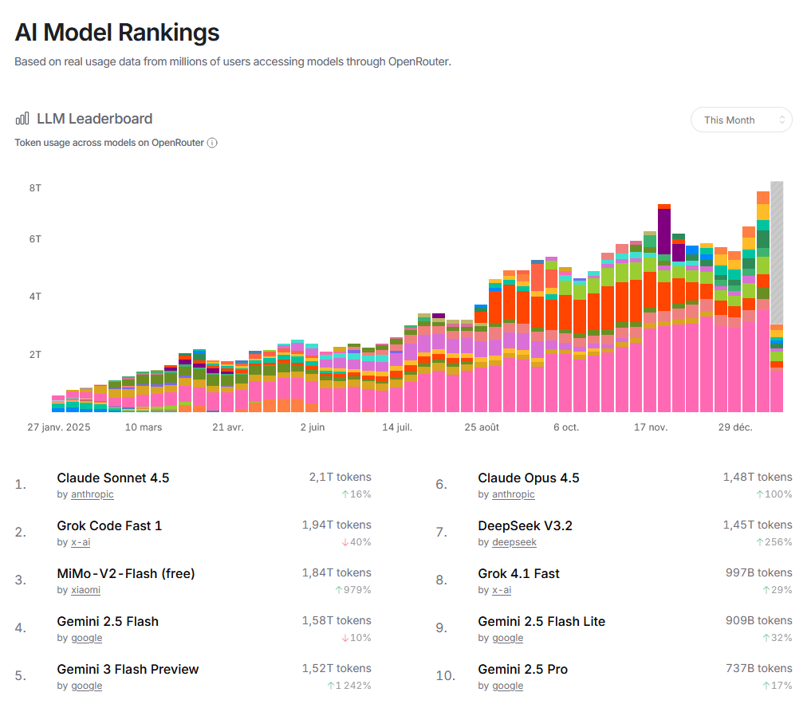
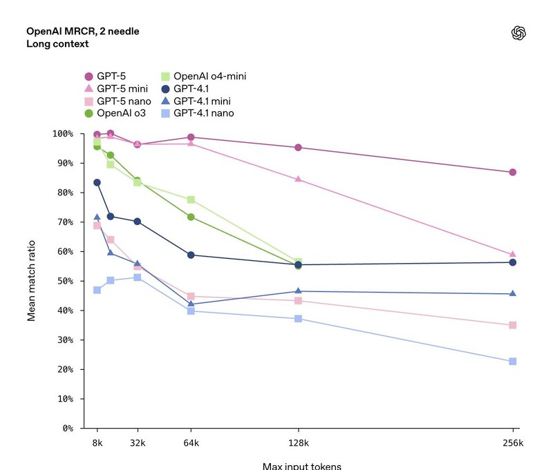
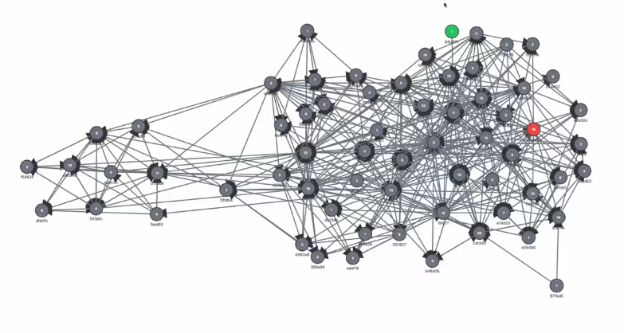
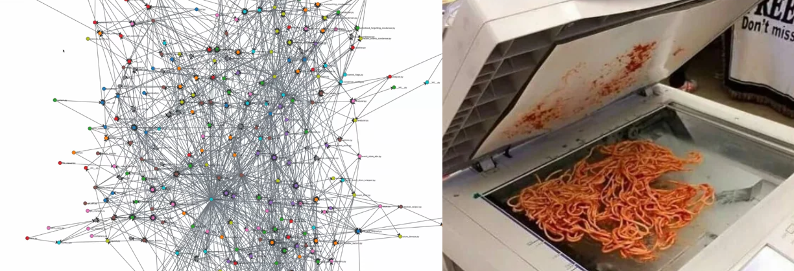
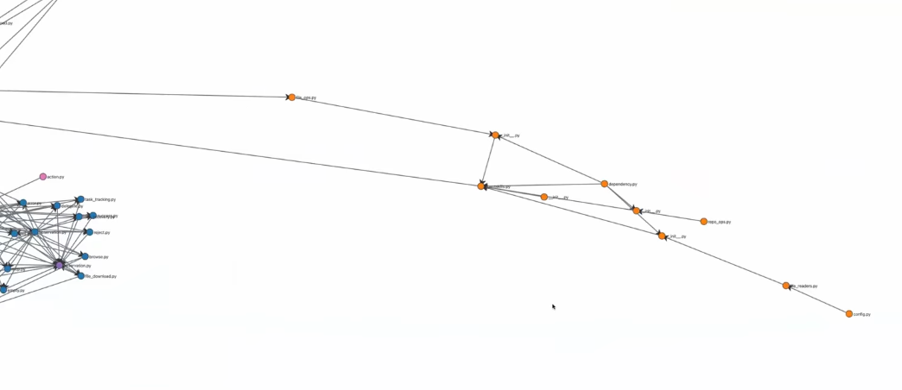
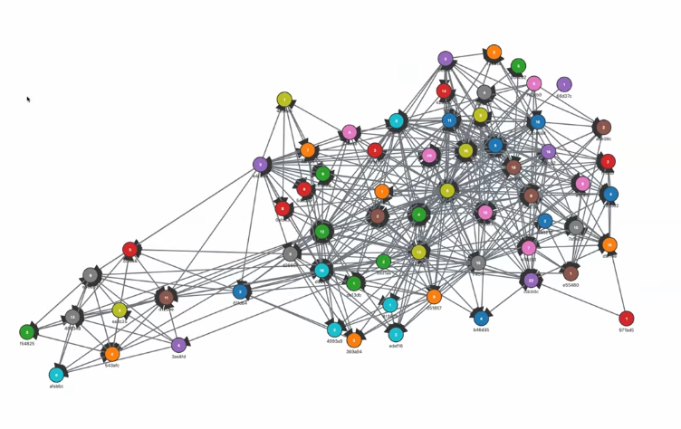

- Mistral revient dans la course avec Devstral 2
- Tendance 2025 et 2026 sur le code et les agents
- Analyse de "Automating Massive Parallel AI Coding", présentation d'OpenHands (partenaire de Mistral AI)
- Anthropic lance Claude Opus 4.5, un nouveau modèle surpuissant pour le code
- Nouvelles tendances sur le développement assisté par IA

## Mistral

Mistral annonce Devstral 2 montrant une stratégie payante sur l'industrialisation de l'écriture de code. Devstral 2 offre des modifications fill-in-the-middle dans un répertoire de code basé sur une instruction en langage naturel. Rivalisant avec les modèles frontiers comme Sonnet 4.5, pas encore Opus 4.5.

Sur OpenRouter, Devstral 2 a une version payante et une version gratuite `mistralai/devstral-2512:free` (dépréciée le 27 janvier 2026).

> "Devstral 2 is a state-of-the-art open-source model by Mistral AI specializing in agentic coding. It is a 123B-parameter dense transformer model supporting a 256K context window. Devstral 2 supports exploring codebases and orchestrating changes across multiple files while maintaining architecture-level context. It tracks framework dependencies, detects failures, and retries with corrections—solving challenges like bug fixing and modernizing legacy systems. The model can be fine-tuned to prioritize specific languages or optimize for large enterprise codebases. It is available under a modified MIT license."

<!--more-->








## Retrospective 2022-2026:

2022 -  ChatGPT › Sortie le November 30, 2022
Données conversationnelles (debugging, bonne productivité sur le code, tâche simples (ex: python matplotlib)). Beaucoup de volume → qualité limitée. Ajout rapide de la recherche web comme source de vérité.

2023 - Copilot & co entrent vers l’IDE : fill-in-the-middle, continue sur un commentaires, corrige la syntaxe, signaux (accepté/refusé). Moins de volume brut, mais fort gain de qualité (supervision naturelle) contexte + feedback humain.

2024 - Arrivée progressive des agents: orchestration plan→actions→résultats. Fin 2024, les MCP standardisent les tool calls → Meilleure interopérabilité + récupération progressive de contexte de meilleure qualité (densité + pertinence à la tâche). Multimodal de plus en plus fiables (Pixtral)

2025 - Montée en puissance des IDE agentiques. Amélioration des performances et de l'autonomie avec contexte plus large (OpenAI Deepsearch, Deepseek). L'écriture de code devient ultra-rapide et le gain de productivité dévient substantiel pour le prototypage web. (Gemini3, Claude Opus 4.5, Devstral2)

2026? - Agents sandbox dans des IDE propriétaires : instruction → plan → act → PR (code+tests+docs). Les agents développent en parallèle sur branches et utilise le contexte-sharing pour assembler les features sélectionnées dans les branches. Human-in-the-loop pour assembler et valider les features. Uniformisation de la qualité sur contexte large

## TLDR ##

2022 — Conversations massives, peu supervisées

2023 — Intégration IDE + feedback (accept/refuse)

2024 — arrivée des agents (plan → act → validation)

2025 — agents autonomes avec MCP (plan → act)

2026? — multi-agents, code shopping

---

_Logiciel et ingénierie.png>)




## Des plugins IDE aux agents cloud

Les agents excellent pour les petites tâches atomiques — celles qui se résolvent en un seul commit. Cependant, le développement logiciel ne se limite pas à cela : planification, décomposition, opérations, QA, architecture... L'idée d'un agent remplaçant entièrement un ingénieur reste encore lointaine.

Certaines tâches semblent automatisables mais restent hors de portée des agents actuels :
- Réécrire un programme de C ou COBOL vers Java
- Migrer de VueJS vers React
- Refactoriser un monolithe en architecture modulaire

---

## L'orchestration multi-agents en pratique

| Composant | Description |
|-----------|-------------|
| **Outils de décomposition** | Découpage des projets en morceaux adaptés aux agents |
| **Fixing & Verifying** | Spécification des corrections et validation du succès |
| **Suivi de progression** | Monitorer le statut de chaque agent |

### Fixers et Verifiers

- **Fixer** : Un prompt indiquant à l'agent comment effectuer la migration
- **Verifier** : Un programme vérifiant que le code compile et n'a pas d'avertissements de dépréciation

Ces outils peuvent être personnalisés sous forme de prompts LLM ou de scripts exécutables.

---

## L'humain dans la boucle : une nécessité absolue
L'objectif d'OpenHands est d'utiliser des agents de manière réfléchie pour des tâches à grande échelle. Réduire les délais de projet de **mois à jours** en déployant une flotte d'agents sur une tâche correctement décomposée.

### Scalabilité actuelle

Robert Brennan, de l'équipe OpenHands, partage son expérience :
> « Je gère actuellement au maximum 5 agents simultanément, contre 3 il y a quelques mois. Avec les bons outils en place, j'espère pouvoir passer à des dizaines. »

---

## Mesurer la complexité du code

Dans la présentation d'OpenHands, des métriques apparaissent comme **Halstead** et **complexité cyclomatique**. OpenHands utilise ces métriques car vise une usine à code, donc la capacité à évaluer la complexité du code est primordiale pour mieux évaluer la capacité des architectures multi-agents sur différentes complexité.

### Processus en deux étapes

1. **Vérification** : Le code a-t-il besoin de modifications ou est-il correct ?
2. **Correction** : Appliquer les changements nécessaires

### Bonnes pratiques

- Rendre tout aussi statique que possible (no moving parts)
- Ne pas utiliser de LLM pour la vérification si possible, privilégier les outils d'analyse statique de code
- Pour Python : MyPy, pyright, flake8, pylint, bandit, safety, etc. ?

### Vérifications

```
- this file is not compatible with version x.x.x "..."
- this file is compatible with version x.x.x "..."
...
```



L'objectif est d'opérer sur l'ensemble de la base de code, en vérifiant et corrigeant tous les fichiers selon une instruction. Commence par les fichiers en périphérie, puis remonter petit à petit.
Chaque nœud est classé du moins dépendant au plus dépendant, vérifié et l'instruction de correction est appliquée.

### Principes de décomposition des tâches

- **One-ish shottable** : Tâche réalisable en une seule passe
- **Single commit** : Changement atomique
- **Executable en parallèle** : Pas de blocages
- **Vérifiable** : Peut être validé comme correct ou incorrect
- **Dépendances claires** entre les tâches
- **Spécifique** pour que l'agent puisse comprendre la tâche à réaliser, la corriger et la soumettre à révision humaine


### Partage de contexte

Faire en sorte que les agents soient conscients de la progression des autres et partagent un contexte commun.
*En cours de développement*

---

## Visualisation des dépendances

Un répertoire classique de code devient rapidement complexe et inter-dépendant sans hygiène rigoureuse.



Regrouper les fichiers par dépendances permet de découper le travail en unités indépendantes.




Utiliser les dépendances pour assigner les tâches aux agents et suivre la progression d'une instruction.


---

*Basé sur la présentation « Automating Massive Refactors with Parallel Agents » par l'équipe OpenHands.*

- **Voir la présentation complète** : [YouTube - OpenHands](https://www.youtube.com/watch?v=MKrPPa6lE0s)
- **Essayer OpenHands** : [github.com/OpenHands/OpenHands](https://github.com/OpenHands/OpenHands)


Lucas Boulé, 21 janvier 2026