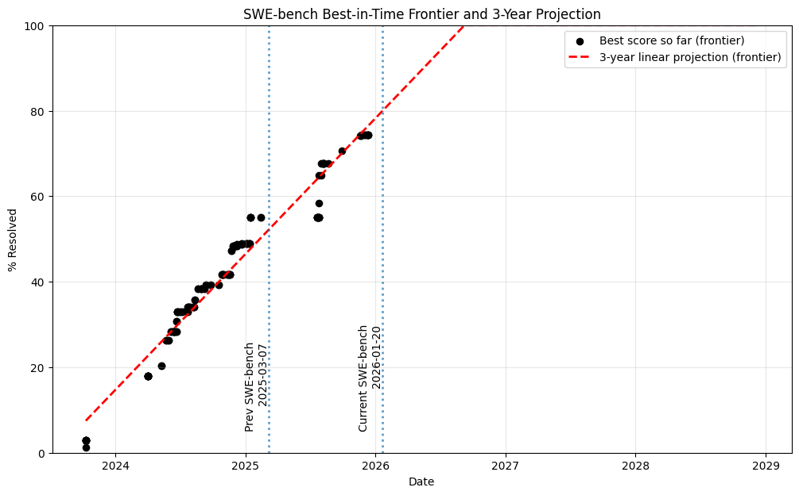

## Sujets abordés

- Mistral revient dans la course avec Devstral 2
- Tendance 2025 et 2026 sur le code et les agents
- Analyse de "Automating Massive Parallel AI Coding", présentation d'OpenHands (partenaire de Mistral AI)
- Anthropic lance Claude Opus 4.5, un nouveau modèle surpuissant pour le code
- Nouvelles tendances sur le développement assisté par IA

## Mistral

Mistral annonce Devstral 2 montrant une stratégie payante sur l'industrialisation de l'écriture de code. Devstral 2 offre des modifications fill-in-the-middle dans un répertoire de code basé sur une instruction en langage naturel. Rivalisant avec les modèles frontiers comme Sonnet 4.5, pas encore Opus 4.5.

Sur OpenRouter, Devstral 2 a une version payante et une version gratuite `mistralai/devstral-2512:free` (dépréciée le 27 janvier 2026).

> "Devstral 2 is a state-of-the-art open-source model by Mistral AI specializing in agentic coding. It is a 123B-parameter dense transformer model supporting a 256K context window. Devstral 2 supports exploring codebases and orchestrating changes across multiple files while maintaining architecture-level context. It tracks framework dependencies, detects failures, and retries with corrections—solving challenges like bug fixing and modernizing legacy systems. The model can be fine-tuned to prioritize specific languages or optimize for large enterprise codebases. It is available under a modified MIT license."

<!--more-->




## Récapitulatif des tendances

| Année | Évolution | Caractéristiques |
|-------|-----------|------------------|
| **2022** | ChatGPT (Nov 30) | Données conversationnelles, debugging, productivité sur le code, tâches simples (ex: Python matplotlib). Volume élevé → qualité limitée. |
| **2023** | Intégration IDE | Fill-in-the-middle, continuation sur commentaires, correction de syntaxe, signaux (accepté/refusé). Moins de volume brut mais gain de qualité significatif. |
| **2024** | Arrivée des agents | Orchestration (plan→actions→résultats) avec logs. MCP standardisent les tool calls → meilleure interopérabilité et contexte de qualité. Multimodal fiable (Pixtral). |
| **2025** | IDE agentiques | Amélioration des performances et autonomie avec contexte large (OpenAI Deepsearch, Deepseek). Écriture de code ultra-rapide, gain de productivité substantiel pour le prototypage web. |
| **2026?** | Agents sandbox | Instruction → plan → action → PR (code+tests+docs). Développement parallèle sur branches avec contexte-sharing. Human-in-the-loop pour validation. |

## Des plugins IDE aux agents cloud

Aujourd'hui, les agents de codage excellent pour les petites tâches atomiques — celles qui se résolvent en un seul commit. Cependant, le développement logiciel ne se limite pas à cela : planification, décomposition, opérations, QA, architecture... L'idée d'un agent remplaçant entièrement un ingénieur reste encore lointaine.

Certaines tâches semblent extrêmement automatisables mais restent hors de portée des agents actuels :
- Réécrire un programme de C ou COBOL vers Java
- Migrer de VueJS vers React
- Refactoriser un monolithe en architecture modulaire

Grâce aux avancées des LLMs et des interfaces développeur, nous progressons rapidement sur ces défis de grande envergure.

---

## L'orchestration multi-agents en pratique

### Le principe

Imaginons que vous souhaitiez porter votre base de code d'une ancienne version de Java vers une nouvelle. Cette tâche est très automatisable — la majeure partie du travail consiste en une copie de logique ligne par ligne. Il y aura des parties délicates, comme la mise à jour de fonctions dépréciées incompatibles, mais 90% du travail est de la traduction pure.

### La décomposition des tâches

La première étape est de **décomposer cette tâche**. Si vous dites simplement à un agent « porte cette base de code vers Java 25 », il risque de tourner en rond pendant plusieurs heures avant de livrer une solution désespérément incomplète.

Il faut découper en petites tâches réalisables en une seule passe (ou deux/trois) par un agent. Idéalement, chaque agent contribue un seul commit ou pull request à la solution finale, et chaque contribution peut être facilement validée par un humain.

### Stratégies de décomposition

**Décomposition horizontale** : Traiter répertoire par répertoire, fichier par fichier, ou classe par classe. Efficace pour les tâches incrémentielles comme l'ajout d'annotations de type à une application Python.

**Décomposition verticale** : Basée sur l'analyse des dépendances. Le SDK de refactorisation d'OpenHands inclut des outils d'analyse qui identifient automatiquement les parties indépendantes de votre base de code.

---

## Le workflow Git pour les refactorisations massives

```mermaid
gitGraph
    commit
    branch v1-refactor
    checkout v1-refactor
    branch v1-refactor/component-a
    branch v1-refactor/component-b
    branch v1-refactor/component-c
    checkout v1-refactor
    merge v1-refactor/component-a
    merge v1-refactor/component-b
    merge v1-refactor/component-c
    checkout main
    merge v1-refactor
```

### Étapes du processus

1. **Créer une branche principale de refactorisation** : `v1-refactor`
2. **Ajouter le scaffolding** : Description dans `AGENTS.md` ou microagent dans `.openhands/microagents/refactor.md`
3. **Chaque agent crée sa propre branche** depuis `v1-refactor`
4. **Les agents soumettent des PRs vers `v1-refactor`** (pas vers `main` !)
5. **Revue humaine** : CI/CD, tests manuels, inspection du code
6. **Fusion avec pull des derniers changements** pour les agents restants
7. **PR finale vers `main`** une fois tout le travail terminé

---

## Le Refactor SDK d'OpenHands

Pour les projets de refactorisation à grande échelle, OpenHands a développé le **Refactor SDK**, une boîte à outils spécifiquement conçue pour automatiser les tâches de refactorisation avec des agents IA.

### Fonctionnalités principales

| Composant | Description |
|-----------|-------------|
| **Outils de décomposition** | Découpage des projets en morceaux adaptés aux agents |
| **Fixing & Verifying** | Spécification des corrections et validation du succès |
| **Suivi de progression** | Monitorer le statut de chaque agent |

### Fixers et Verifiers

- **Fixer** : Un prompt indiquant à l'agent comment effectuer la migration
- **Verifier** : Un programme vérifiant que le code compile et n'a pas d'avertissements de dépréciation

Ces outils peuvent être personnalisés sous forme de prompts LLM ou de scripts exécutables.

---

## L'humain dans la boucle : une nécessité absolue

Utiliser des agents de manière réfléchie pour des tâches à grande échelle peut être un énorme levier. Vous pouvez réduire les délais de projet littéralement de **mois à jours** en déployant une flotte d'agents sur une tâche correctement décomposée.

### Scalabilité actuelle

Robert Brennan, de l'équipe OpenHands, partage son expérience :

> « Je gère actuellement au maximum 5 agents simultanément, contre 3 il y a quelques mois. Avec les bons outils en place, j'espère pouvoir passer à des dizaines. »

---

## Mesurer la complexité du code

Dans la présentation d'OpenHands, deux métriques apparaissent : **Halstead** et **complexité cyclomatique**. OpenHands utilise ces métriques car c'est une usine à code, donc la capacité à évaluer la complexité du code est importante pour mieux gérer des modèles multi-agents en parallèle.

### Processus en deux étapes

1. **Vérification** : Le code a-t-il besoin de modifications ou est-il correct ?
2. **Correction** : Appliquer les changements nécessaires

### Bonnes pratiques

- Rendre tout aussi statique que possible
- Ne pas utiliser de LLM pour la vérification si possible, privilégier les outils d'analyse statique de code
- Pour Python : MyPy, pyright, flake8, pylint, bandit, safety, etc.

### Résultats de vérification typiques

```
- this file does not meet the criteria "..."
- this one...
...
```

### Magie Git avec Worktree

```bash
# Créer un nouveau worktree pour la branche de refactorisation
git worktree add ../v1-refactor-worktree v1-refactor

# Créer une branche pour l'agent depuis la branche de refactorisation
git checkout -b v1-refactor/component-a

# Exécuter l'agent dans le nouveau worktree/branche
# Commit des changements
# Push de la branche vers le remote
```

Résultats typiques :
- Branche de l'agent créée : `v1-refactor/component-a`
- Agent a complété les changements et poussé la branche
- PR créée de `v1-refactor/component-a` vers `v1-refactor`


L'objectif est de rendre le graphe entièrement vert en vérifiant et corrigeant tous les fichiers et en progressant sur le graphe de dépendances.

> "Solve from the periphery to the center" - commencer par les fichiers indépendants, puis passer aux dépendants.

Chaque nœud est classé du moins dépendant au plus dépendant, vérifié, et si NOK, la correction est appliquée.

### Principes de décomposition des tâches

- **One-ish shottable** : Tâche réalisable en une seule passe
- **Single commit** : Changement atomique
- **Executable en parallèle** : Pas de blocages
- **Vérifiable** : Peut être validé comme correct ou incorrect
- **Dépendances claires** entre les tâches
- **Assez petite** pour que l'agent puisse la prendre, la corriger et la soumettre à révision humaine

### Partage de contexte

Faire en sorte que les agents soient conscients de la progression des autres et partagent un contexte commun.

*En cours de développement (non fonctionnel), mais voyons comment les agents parallèles évolueront en 2026.*

---

## Visualisation des dépendances

Un répertoire classique de code devient rapidement complexe et inter-dépendant sans hygiène rigoureuse.


Regrouper les fichiers par dépendances permet de découper le travail en unités indépendantes.


Utiliser la visualisation des dépendances pour assigner les tâches aux agents et suivre la progression d'une instruction.


---

*Basé sur la présentation « Automating Massive Refactors with Parallel Agents » par l'équipe OpenHands.*

- **Voir la présentation complète** : [YouTube - OpenHands](https://www.youtube.com/watch?v=MKrPPa6lE0s)
- **Essayer OpenHands** : [github.com/OpenHands/OpenHands](https://github.com/OpenHands/OpenHands)
